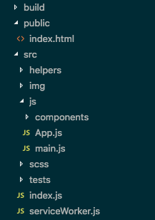

# 1. How do you prefer to handle asynchronous state updates

For asynchronous data I would implement an asynchronous function and await the results. A trivial example might look something like:


```javascript
// get all stores
let stores = () => {
  return new Promise(resolve => {
    // fetch stores endpoint
    fetch('https://wholefoodsmarket.com/api/stores')
      .then(res => {
        // return results
        resolve(res);
      })
      .catch(err => {
        // log error
        console.log("Error fetching stores");
      });
  });
}

// get stores
let getStores = async () => {
  let results = await stores();
  // format and return results
  return results.json();
}

getStores().then(data => {
  // do something with `data`
});
```

If Internet Explorer support is needed then I would use a polyfill.

# 2. Can you tell me a little bit about how you structure your projects

Sure, if it's a front end project i'd start of with `npm init -y`. I'd probably install the parcelJS bundler which has hot module reloading, babel, and postCSS built in. I'd run the project with something like `parcel src/index.(js/html)` which would then start watching and refreshing my local server on save. As far as folder structure for these types of projects, they would normally look similar to this:



> `build` being what is compiled after building for production

> `helpers` for api and other global / commonly used services

If it were a project using Node I would set up two diffent directories

1. api (node)
2. client (html,css,js)

# 3. How do you decide which state goes in your UI components vs. your data store

Only the state needed for the current user's route/view would be something I'd pull into a component. Otherwise, I would keep this data outside of a component and store/call/mutate when necessary.

# 4. If you had to make a site work offline, what kind of architecture would you use?

The PWAs I've built have used Google's Workbox. Most of what was needed to prompt the user to "Add to Homescreen" or work offline was accomplished by creating icons of various sizes and setting the `start_url` in the manifest.json file.

# 5. What is your preferred front end stack?

I do not have a preferential HTML templating language as the only one I have experiece with is Laravel's Blade language/syntax.

As far as CSS goes, I tend to use SCSS where possible or CSS custom properties/variables if the project does not need IE support. I do have experience in a few frameworks/libraries like Bootstrap, Foundation, Bulma, Vuetify, but most often I rely on flexbox or grid these days.

For Javascript I leverage babel if writing vanilla JS or VueJS if it's a larger project. The last several months I've done a lot of stuff in React and Gatsby ([portfolio site](https://joeisacommonname.com/?utm_source=wholefoods)), but I would say I have more experience with Vue at the moment.

To answer the question:

- Plain HTML
- Plain CSS (postCSS/SCSS)
- Vanilla JS (but would like to use React or Vue more often)
- AJAX (Axios, unless IE support is not needed, in which case, I would use `fetch`)